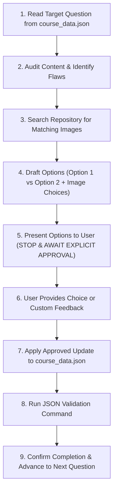

# A-Level Music Technology Quiz Revision & Standardization Workflow

This Markdown instruction guide documents the exact interactive workflow for reviewing, refining, and validating questions in `src/data/course_data.json` for Edexcel A-Level Music Technology revision quizzes.

---

## 1. Core Principles & Standards

### A. Question & Distractor Guidelines
1. **Syllabus Relevance**: All content must align directly with the **Edexcel A-Level Music Technology** specification (Component 1, 2, 3, and 4 — recording techniques, audio fundamentals, microphones, synthesizers, dynamic processors, EQ, acoustics, DAW editing, and production history).
2. **Simplified, Punchy Answers**:
   - Keep choices concise, direct, and unambiguous.
   - Avoid needlessly complex academic jargon or tangential details (e.g. use "phase cancellation" rather than esoteric acronyms unless explicitly required by the syllabus).
   - **Plausible Distractors**: Eliminate joke answers (e.g. *"No microphone needed"*, *"It sounds too good"*, *"To record in 3D binaural"*). Replace them with realistic, technically credible distractors.
3. **Question Titles**: Replace placeholder titles (e.g. `"Q8: Question 8"`) with descriptive, concept-focused titles (e.g. `"Q8: Kick Drum Resonant Head Placement"`).

### B. Expert Explanations & Quotes
1. **Focused Explanations**: The explanation must directly explain **why** the correct answer is right and the underlying acoustic/engineering concept. Avoid tangential trivia.
2. **Authoritative Quotes**:
   - Replace generic or placeholder quotes (e.g. *"Small improvements lead to big results"*, *"Drum Tuning"*, or random childhood stories).
   - Use quotes from authentic production standards, audio recording textbooks, or recognized engineering principles (e.g. *"Modern Studio Recording Principles"*, *"Microphone Techniques Handbook"*).

### C. Image Selection & Generation Policy
1. **Search Existing Pool First**:
   - Always search local repository directories first:
     - `public/images/`
     - `public/images/Dictiionary_Quiz_image_Pool/`
     - `public/images/svg/`
     - `public/images/gen/`
2. **Evaluation Criteria**:
   - Does the image accurately depict the exact concept in the question?
   - Is the visual high quality, clean, and legible?
   - If an existing image is an exact match (e.g. studio close-up of tom mics, kick drum cutaway), present it as the primary option.
3. **Generate When Necessary**:
   - If existing images are missing, low-resolution, or misleading, generate a dedicated high-resolution, modern studio diagram or infographic (16:9 aspect ratio, clean studio aesthetic).
   - When generating, copy the generated asset from the artifact temp directory into `public/images/gen/` with a clean, descriptive filename.

---

## 2. Step-by-Step Question Review Protocol



### **Step 1: Inspect Target Question**
Locate the question in `src/data/course_data.json`:
- `sections[1]` contains Topic Mastery Quizzes.
- Note the quiz ID (e.g. `quiz-topic-2_p1`, `quiz-topic-2_p2`), question index, and total line range.
- Examine:
  - `content` (question text)
  - `answers` (distractors and correct flag)
  - `expert_explanation`
  - `expert_quote`
  - `img` path
  - `title`

### **Step 2: Identify Deficiencies**
Check for:
- True/False questions that should be converted to multi-choice.
- Misaligned images (e.g. vocal mic linked to a kick drum question).
- Placeholder/tangential quotes or explanations.
- Overly wordy or ambiguous options.

### **Step 3: Search for Media**
Use search commands to find candidate graphics:
```bash
# Search for keyword in image directory
fd -e png -e svg -e jpg "<keyword>" public/images
```
Review the candidate images and verify clarity.

### **Step 4: Formulate Proposal Options**
Draft two structured options:
- **Option 1 (Recommended)**: Focused, modern, syllabus-aligned rephrasing with punchy, high-discrimination answers.
- **Option 2 (Faithful)**: Keeps the core spirit of the existing question, fixing only obvious grammatical flaws and distractors.
- **Image Options**: List Option A (repo diagram), Option B (repo photo), or Option C (new generation).

### **Step 5: Present to User & Wait**
> **CRITICAL RULE**: Never modify `course_data.json` before presenting the proposed options to the user and receiving explicit approval.

Format the proposal clearly:
```markdown
### Proposed Options for Review:

#### Option 1: [Concept Title] (Recommended)
- **Question**: "[Question text]"
- **Answers**:
  - A. [Answer 1] (Correct)
  - B. [Answer 2]
  - C. [Answer 3]
  - D. [Answer 4]
- **Expert Explanation**: [Clear, concept-driven explanation]
- **Quote**: "[Memorable engineering quote]" — [Author/Source]

#### Image Options:
- **Option A**: [Path and description]
- **Option B**: [Path and description]
```

### **Step 6: Execute Approved Changes**
Once the user replies with their choice:
1. Update `src/data/course_data.json` with `replace_file_content`.
   - Update `content`, `answers`, `expert_explanation`, `expert_quote`, `img`, `title`, and the formatted HTML `explanation` string (including the embedded `` tag and `<blockquote>`).
2. Run JSON syntax verification immediately:
   ```bash
   node -e "JSON.parse(require('fs').readFileSync('src/data/course_data.json')) && console.log('JSON VALID')"
   ```
3. Confirm the update to the user and present the next question in sequence.

---

## 3. Progress Tracking Checklist

### **Topic 1: Sound & Audio Fundamentals**
- [x] Part 1 (`quiz-topic-1_p1`): Q1 to Q10 **(Complete)**
- [x] Part 2 (`quiz-topic-1_p2`): Q11 to Q20 **(Complete)**

### **Topic 2: Microphones**
- [x] Part 1 (`quiz-topic-2_p1`): Q1 to Q10 **(Complete)**
- [ ] Part 2 (`quiz-topic-2_p2`):
  - [ ] **Q1 (Q11 overall)**: Distance Micing in Untreated Rooms *(Pending approval)*
  - [ ] **Q2 (Q12 overall)**: Mic Pad (-20 dB) usage
  - [ ] **Q3 (Q13 overall)**: Ribbon mic care / phantom power
  - [ ] **Q4 (Q14 overall)**: Dynamic vs Condenser SPL handling
  - [ ] **Q5 (Q15 overall)**: Proximity effect
  - [ ] **Q6 (Q16 overall)**: Pop filter purpose & placement
  - [ ] **Q7 (Q17 overall)**: Stereo micing techniques (X-Y, Spaced Pair, Mid-Side)
  - [ ] **Q8 (Q18 overall)**: Snare drum top/bottom phase inversion
  - [ ] **Q9 (Q19 overall)**: Overhead mic placement (ORTF / Spaced Pair)
  - [ ] **Q10 (Q20 overall)**: Off-axis coloration and polar pattern rejection
